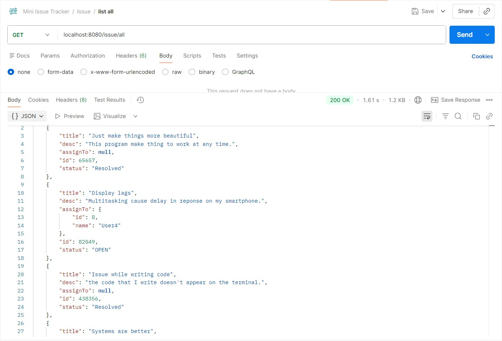
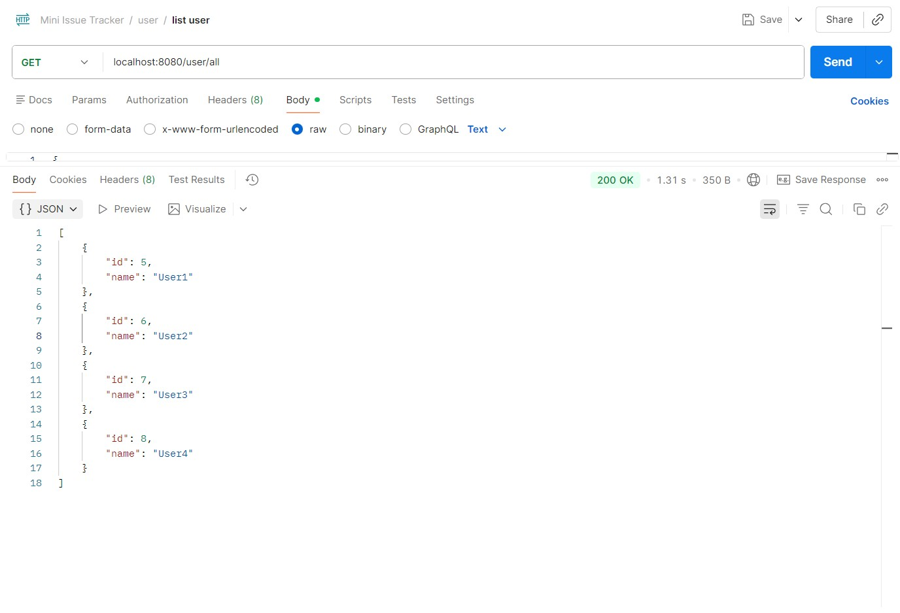

# Backend 
This is the backend code of my mini-issue-tracker project.

### Tech Stack
- Spring boot
- MYSQL
- REST API's

### End points
1. Issue
    - /issue/create --> Create new Issue
    - /issue/all --> Get all the issues
    - /issue/resolve/{id} --> update the status of the issue to RESOLVED
    - /issue/assign/{id} --> Assign user to a issue.
    - /issue/delete/{id} --> Remove the issue
2. User
    - /user/create --> Create a new user
    - /user/all --> get list of all users

### Screenshots

 Get All </img>
 All users </img>

## Author
Divyanshu Singh  
© 2026 All Rights Reserved